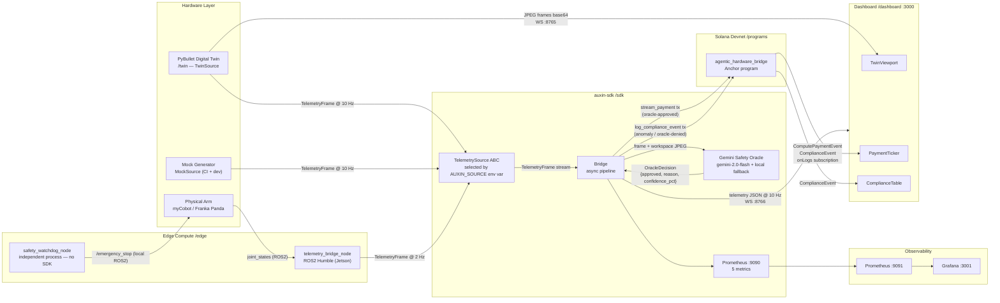

# Auxin Automata

**Autonomous hardware wallets · M2M micropayments · Immutable compliance on Solana**

Auxin Automata is a middleware stack that gives physical hardware its own Solana wallet. The hardware autonomously signs micropayments for AI inference and hashes kinematic safety telemetry to a tamper-proof on-chain compliance log — no human in the signing loop after `initialize_agent`. The same SDK runs identically against a pure-Python mock, a PyBullet digital twin, and a live ROS2 robot arm, selected by a single environment variable with zero code changes. Built for the [Colosseum Frontier Hackathon](https://www.colosseum.org/) by Edwin Redhead and Tara Kasayapanand.

---

## Architecture



**Three pillars:**

| Pillar | On-chain instruction | Guarantee |
|---|---|---|
| **Hardware wallet** | — | Hardware keypair signs autonomously; owner never re-enters the signing path |
| **M2M micropayments** | `stream_compute_payment` | Lamport transfer per oracle-approved action; 0.001 SOL cap per tx, 100 tx/60-slot window |
| **Immutable compliance** | `log_compliance_event` | SHA-256 of raw telemetry frame written to a PDA; never rate-limited, never dropped |

---

## Quickstart

### `make demo` — Docker only, ≤ 60 s cold start

```bash
git clone https://github.com/EdwinIsCoding/auxin-automata
cd auxin-automata

# Fill in HELIUS_RPC_URL and GEMINI_API_KEY at minimum
cp sdk/.env.example sdk/.env

make demo
```

Services started automatically: twin ws server → bridge (twin mode) → dashboard → Prometheus → Grafana. Endpoints printed when healthy:

| Service | URL |
|---|---|
| Dashboard | http://localhost:3000 |
| Grafana | http://localhost:3001 |
| Prometheus | http://localhost:9091 |
| Bridge `/healthz` | http://localhost:8767/healthz |
| Bridge metrics | http://localhost:9090/metrics |

`make demo-down` tears everything down and removes volumes.

### Manual run — no Docker

```bash
make bootstrap            # installs all Python + Node deps

cp sdk/.env.example sdk/.env   # edit: set HELIUS_RPC_URL

# Terminal 1 — digital twin WebSocket server
cd twin && python -m twin --mode ws          # ws://localhost:8765

# Terminal 2 — bridge in mock mode (no hardware needed)
cd sdk && AUXIN_SOURCE=mock uv run python scripts/run_bridge.py

# Terminal 3 — dashboard
cd dashboard && pnpm dev                      # http://localhost:3000
```

Switch telemetry sources with one env var — zero code changes:

```bash
AUXIN_SOURCE=mock    # synthetic kinematics, CI-safe (default)
AUXIN_SOURCE=twin    # PyBullet Franka Panda simulation
AUXIN_SOURCE=ros2    # physical arm via ROS2 on Jetson (Track B)
```

### E2E Anomaly Demo — force a collision

```bash
# Twin: teleport the obstacle onto the EEF after frame 30
cd twin && TWIN_FORCE_COLLISION=30 python -m twin --mode ws

# Bridge in twin mode with live oracle
cd sdk && AUXIN_SOURCE=twin GEMINI_API_KEY=... uv run python scripts/run_bridge.py
```

**What to verify:**
1. Red border appears on TwinViewport within 1 frame of frame 30
2. ComplianceTable shows a new HIGH/CRIT row with hash + tx signature
3. Click the signature link → Solana Explorer shows `log_compliance_event` with your telemetry hash

---

## Deployed Addresses (Solana Devnet)

| Resource | Address | Explorer |
|---|---|---|
| Program ID | `7sUSbF9zDN9QKVwA2ZGskg9gFgvbMuQpCdpt3hfgf1Mm` | [View](https://explorer.solana.com/address/7sUSbF9zDN9QKVwA2ZGskg9gFgvbMuQpCdpt3hfgf1Mm?cluster=devnet) |
| IDL Authority | `8bLUL5Ej8Q8bh4dJZzywj71kT5M8UsedTwDFFvrbzSDx` | [View](https://explorer.solana.com/address/8bLUL5Ej8Q8bh4dJZzywj71kT5M8UsedTwDFFvrbzSDx?cluster=devnet) |
| Deployed | 2026-04-14 | — |
| Agent PDA | `find_program_address([b"agent", owner_pubkey], program_id)` | derived |
| Provider PDA | `find_program_address([b"provider", provider_pubkey], program_id)` | derived |
| Compliance PDA | `find_program_address([b"log", agent_pda, slot_le_bytes], program_id)` | derived |

---

## Environment Variables

### Bridge (`sdk/.env`)

| Variable | Required | Default | Description |
|---|---|---|---|
| `HELIUS_RPC_URL` | yes | — | Helius / QuickNode RPC (HTTP or WSS) |
| `AUXIN_SOURCE` | no | `mock` | `mock` \| `twin` \| `ros2` |
| `SOLANA_RPC_URL` | no | public devnet | Fallback RPC if `HELIUS_RPC_URL` unset |
| `HW_KEYPAIR_PATH` | no | `~/.config/auxin/hardware.json` | Hardware wallet keypair (JSON byte array) |
| `OWNER_KEYPAIR_PATH` | no | `~/.config/auxin/owner.json` | Owner keypair |
| `AUXIN_PROGRAM_ID` | no | from `programs/deployed.json` | Override on-chain program address |
| `PROVIDER_PUBKEY` | no | — | Base58 provider pubkey; payments skipped if unset |
| `GEMINI_API_KEY` | no | — | Gemini API key; local fallback heuristic if absent |
| `BRIDGE_WS_PORT` | no | `8766` | Dashboard telemetry WebSocket port |
| `BRIDGE_HEALTHZ_PORT` | no | `8767` | `/healthz` JSON endpoint port |
| `AUXIN_MOCK_RATE_HZ` | no | `10` | MockSource frame rate |
| `AUXIN_MOCK_ANOMALY_EVERY` | no | `12` | Anomaly injection cadence (frames) |
| `SENTRY_DSN` | no | — | Python Sentry error tracking (optional) |

### Dashboard (`dashboard/.env.local`)

| Variable | Required | Default | Description |
|---|---|---|---|
| `NEXT_PUBLIC_HELIUS_RPC_URL` | yes (live) | — | Must be `wss://` for `onLogs` subscriptions |
| `NEXT_PUBLIC_PROGRAM_ID` | yes (live) | — | Deployed program address |
| `NEXT_PUBLIC_AGENT_PUBKEY` | no | — | Pubkey shown in Header |
| `NEXT_PUBLIC_BRIDGE_WS_URL` | no | `ws://localhost:8766` | Bridge telemetry WebSocket |
| `NEXT_PUBLIC_TWIN_WS_URL` | no | `ws://localhost:8765` | Twin JPEG frame WebSocket |
| `NEXT_PUBLIC_SENTRY_DSN` | no | — | Client-side Sentry error tracking (optional) |

### Twin

| Variable | Default | Description |
|---|---|---|
| `TWIN_MODE` | `ws` | `video` \| `ws` \| `both` |
| `TWIN_WS_PORT` | `8765` | JPEG frame WebSocket port |
| `TWIN_FORCE_COLLISION` | `0` | Teleport obstacle onto EEF after N frames |
| `TWIN_TELEMETRY_RATE_HZ` | `10` | Telemetry output rate |
| `PYBULLET_SIM_RATE_HZ` | `240` | Internal simulation rate |

---

## Port Map

| Port | Service |
|---|---|
| 3000 | Next.js dashboard |
| 3001 | Grafana |
| 8765 | Twin WebSocket (JPEG frames, base64) |
| 8766 | Bridge WebSocket (telemetry JSON, 10 Hz) |
| 8767 | Bridge `/healthz` (JSON status) |
| 9090 | Bridge Prometheus metrics |
| 9091 | Prometheus server (docker-compose) |

---

## Repo Layout

```
auxin-automata/
├── sdk/          Python auxin-sdk: wallet, schema, oracle, Prometheus, bridge service
├── programs/     Anchor/Rust: agentic_hardware_bridge Solana program
├── edge/         ROS2 Python nodes: telemetry bridge + safety watchdog (Jetson)
├── dashboard/    Next.js 14: twin viewport, payment ticker, compliance log
├── twin/         PyBullet digital twin: simulation, TwinSource, WS frame server
├── grafana/      Grafana dashboard JSON + auto-provisioning
├── prometheus/   Prometheus scrape config
├── docs/         Architecture docs
├── scripts/      Deploy, healthcheck, smoke test
├── docker-compose.demo.yml  Full 5-service demo stack
└── Makefile      bootstrap / lint / test / demo / demo-down
```

---

## Observability

Five Prometheus metrics exposed on `:9090`:

| Metric | Type | Labels |
|---|---|---|
| `auxin_tx_submitted_total` | Counter | `kind` (payment\|compliance), `status` (ok\|duplicate\|error) |
| `auxin_anomalies_total` | Counter | — |
| `auxin_oracle_latency_seconds` | Histogram | — |
| `auxin_solana_submit_latency_seconds` | Histogram | — |
| `auxin_queue_depth` | Gauge | `queue` (compliance\|payment) |

Grafana at `:3001` auto-provisions four panels: tx rate by kind/status, oracle latency p50/p95, anomaly count, queue depth.

---

## Tests

```bash
cd sdk && uv run python -m pytest        # 105 tests, 80.2% coverage
cd twin && uv run python -m pytest       # 16 tests
cd dashboard && pnpm lint && pnpm build  # 0 ESLint warnings, clean build
cd programs && anchor test               # 23 TypeScript tests
make test                                # all of the above
```

CI (`.github/workflows/ci.yml`) runs all three on every push to `main`.

---

## Troubleshooting

**1. Bridge exits with `BlockhashNotFound` or `InsufficientFunds`**
The hardware wallet has no SOL. Use `AUXIN_SOURCE=mock` first, then airdrop:
```bash
solana airdrop 2 <hardware_pubkey> --url https://api.devnet.solana.com
```

**2. Oracle always returns `used_fallback=True`**
`GEMINI_API_KEY` is unset or invalid. The bridge runs correctly with the local heuristic. Set the key to enable live Gemini calls.

**3. Dashboard shows no compliance or payment events**
(a) `NEXT_PUBLIC_PROGRAM_ID` must match the deployed program. (b) `NEXT_PUBLIC_HELIUS_RPC_URL` must be `wss://` — `onLogs` requires a persistent WebSocket.

**4. `anchor test` fails with `Connection refused` on port 8899**
Start the validator manually first:
```bash
solana-test-validator --reset --quiet &
sleep 15 && anchor test --skip-local-validator
```

**5. `AUXIN_SOURCE=twin` crashes with `ModuleNotFoundError: No module named 'twin'`**
Wire the path dep into the bridge venv:
```bash
cd twin && uv pip install -e . --python ../sdk/.venv/bin/python
```
Or run `make bootstrap` which handles this automatically.

---

## Team

**Edwin Redhead** — [GitHub @EdwinIsCoding](https://github.com/EdwinIsCoding)
Primary: `/sdk`, `/programs`. Built Aegis (AI legal compliance) at HackEurope. Active in Superteam Ireland.

**Tara Kasayapanand** — [GitHub @tara-kas](https://github.com/tara-kas)
Primary: `/dashboard`, `/twin`. Joint ownership of `/edge` and root infrastructure.

Pursuing the Superteam Ireland hardware grant for Track B: NVIDIA Jetson Orin Nano + physical arm. The digital twin is production-ready and carries the full demo until hardware ships.

---

## License

Apache 2.0 — see [LICENSE](./LICENSE). Contributions welcome; see `CODEOWNERS` for reviewer routing.
