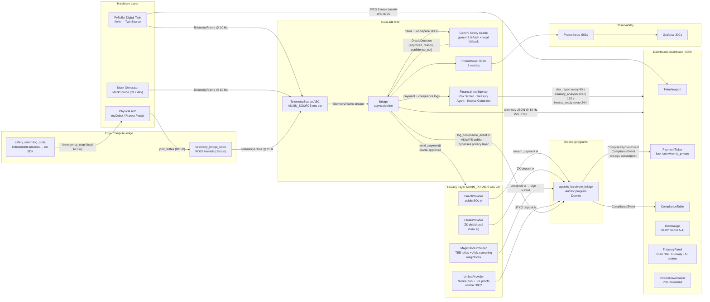

# Auxin Automata

**Autonomous hardware wallets · M2M micropayments · Immutable compliance on Solana**

Auxin Automata is a middleware stack that gives physical hardware its own Solana wallet. The hardware autonomously signs micropayments for AI inference and hashes kinematic safety telemetry to a tamper-proof on-chain compliance log — no human in the signing loop after `initialize_agent`. A built-in Financial Intelligence layer continuously scores machine health, runs a Claude-powered treasury agent to optimise burn rate and runway, and auto-generates PDF invoices for every billing period. The same SDK runs identically against a pure-Python mock, a PyBullet digital twin, and a live ROS2 robot arm, selected by a single environment variable with zero code changes. Built for the [Colosseum Frontier Hackathon](https://www.colosseum.org/) by Edwin Redhead and Tara Kasayapanand.

---

## Architecture



---

## Financial Intelligence Layer

The bridge runs three background workers that turn raw payment and compliance history into actionable financial signals — all without blocking telemetry throughput.

| Worker | Interval | Output |
|---|---|---|
| **Risk Scorer** | 60 s | `RiskReport` — overall score 0–100, grade A–F, 4 weighted dimensions, 7-day trend |
| **Treasury Agent** | 120 s | `TreasuryAnalysis` — burn rate, runway, budget allocation, Claude-powered recommendations |
| **Invoice Generator** | 24 h | PDF invoice (weasyprint) with provider subtotals and compliance summary; served at `GET /invoice/latest` |

### Risk dimensions

| Dimension | Weight | What it measures |
|---|---|---|
| Financial Health | 30% | Runway hours, burn rate stability |
| Operational Stability | 25% | Payment interval regularity, uptime |
| Compliance Record | 25% | Anomaly event rate, severity distribution |
| Provider Diversity | 20% | Number of unique providers, HHI concentration |

### Treasury Agent safety constraints

The Claude-powered treasury agent (`claude-sonnet-4-6`) is the only component with AI-driven auto-execution authority. The allowlist is intentionally minimal:

- `throttle_inference` — reduce oracle call frequency
- `increase_reserve` — shift budget allocation toward reserve

Fund transfers and any other action **can never be marked `auto_executable`**, even if the LLM response tries to set it. The safety filter in `treasury/agent.py::_is_auto_executable_safe()` enforces this at parse time. The agent always returns a valid `TreasuryAnalysis` — on API failure it falls back to a deterministic heuristic (`used_fallback=True`), so the demo never stalls.

### Dashboard panels

- **RiskGauge** — radial arc gauge with grade overlay, 4 animated dimension bars, 7-day sparkline
- **TreasuryPanel** — burn rate, runway (colour-coded by status), budget donut chart, AI summary, action list with priority badges and AUTO indicators
- **InvoiceDownloader** — shows latest period dates and SOL total; one-click PDF download from the bridge HTTP endpoint

---

## Privacy Providers

Payment privacy is controlled by a single environment variable — no code changes required:

```bash
AUXIN_PRIVACY=direct      # default — public SOL transfer, visible on-chain
AUXIN_PRIVACY=cloak       # stealth addresses via cloak.ag ZK shield pool
AUXIN_PRIVACY=magicblock  # TEE rollup via MagicBlock Private Ephemeral Rollups
AUXIN_PRIVACY=umbra       # shielded pool via Umbra mixer (Merkle tree + ZK proofs)
```

Compliance events (`log_compliance_event`) are **always routed directly to the public chain** regardless of the privacy setting. Compliance hashes are the immutable public evidence that the system detected and recorded every safety anomaly — hiding them would defeat their purpose. Privacy applies only to the economic layer (micropayments), never the safety layer.

| Provider | Privacy model | Compliance mechanism | Setup required |
|---|---|---|---|
| `direct` | None — sender → receiver link visible | — | None |
| `cloak` | Stealth addresses via ZK UTXO shield pool | Viewing key for auditor selective disclosure | Node ≥20 + `pnpm install` in `sdk/src/auxin_sdk/privacy/cloak_bridge/` |
| `magicblock` | TEE-based ephemeral rollup; crank settles batches | AML screening (Range) on every API call — no operator infra needed | `MAGICBLOCK_API_KEY` env var |
| `umbra` | Unified mixer pool; Merkle tree + Groth16 ZK proofs; deposit unlinkable from withdrawal | Time-scoped Transaction Viewing Keys for auditor selective disclosure | Umbra sidecar (`docker-compose --profile umbra up umbra-bridge`) |

See [`docs/privacy-overview.md`](docs/privacy-overview.md) for the full comparison and compliance architecture. Provider-specific docs: [Cloak](docs/privacy-cloak.md) · [MagicBlock](docs/privacy-magicblock.md) · [Umbra](docs/privacy-umbra.md).

**Three pillars:**

| Pillar | On-chain instruction | Guarantee |
|---|---|---|
| **Hardware wallet** | — | Hardware keypair signs autonomously; owner never re-enters the signing path |
| **M2M micropayments** | `stream_compute_payment` | Lamport transfer per oracle-approved action; 0.001 SOL cap per tx, 100 tx/60-slot window |
| **Immutable compliance** | `log_compliance_event` | SHA-256 of raw telemetry frame written to a PDA; never rate-limited, never dropped |

---

## Quickstart

### `make demo` — Docker only, ≤ 60 s cold start

```bash
git clone https://github.com/EdwinIsCoding/Auxin_Automata
cd Auxin_Automata

# Fill in at minimum: HELIUS_RPC_URL, GEMINI_API_KEY, ANTHROPIC_API_KEY
cp sdk/.env.example sdk/.env

# First time only — generates keypairs, airdrops SOL, initialises on-chain state
make setup

make demo
```

> **`make setup` is idempotent** — safe to re-run. It generates `~/.config/auxin/hardware.json` and `owner.json` if they don't exist, airdrops 2 SOL to each wallet on Devnet (skipped if balance ≥ 1 SOL), initialises the HardwareAgent PDA, and whitelists the hardware wallet as a provider. Without this step the bridge will fail to start on a fresh machine.

Services started automatically: twin ws server → bridge (twin mode) → dashboard → Prometheus → Grafana. Endpoints printed when healthy:

| Service | URL |
|---|---|
| Dashboard | http://localhost:3000 |
| Grafana | http://localhost:3001 |
| Prometheus | http://localhost:9091 |
| Bridge `/healthz` | http://localhost:8767/healthz |
| Latest invoice | http://localhost:8767/invoice/latest |
| Bridge metrics | http://localhost:9090/metrics |

`make demo-down` tears everything down and removes volumes.

### Manual run — no Docker

```bash
make bootstrap            # installs all Python + Node deps

cp sdk/.env.example sdk/.env   # edit: HELIUS_RPC_URL, GEMINI_API_KEY, ANTHROPIC_API_KEY

# macOS only: weasyprint needs Homebrew GTK libs
export DYLD_LIBRARY_PATH="/opt/homebrew/lib:$DYLD_LIBRARY_PATH"

# Terminal 1 — digital twin WebSocket server
cd twin && python -m twin --mode ws          # ws://localhost:8765

# Terminal 2 — bridge in mock mode (no hardware needed)
cd sdk && AUXIN_SOURCE=mock uv run python scripts/run_bridge.py

# Terminal 3 — dashboard
cd dashboard && pnpm dev                      # http://localhost:3000
```

Switch telemetry sources with one env var — zero code changes:

```bash
AUXIN_SOURCE=mock    # synthetic kinematics, CI-safe (default)
AUXIN_SOURCE=twin    # PyBullet Franka Panda simulation
AUXIN_SOURCE=ros2    # physical arm via ROS2 on Jetson (Track B)
```

### E2E Anomaly Demo — force a collision

```bash
# Twin: teleport the obstacle onto the EEF after frame 30
cd twin && TWIN_FORCE_COLLISION=30 python -m twin --mode ws

# Bridge in twin mode with live oracle
cd sdk && AUXIN_SOURCE=twin GEMINI_API_KEY=... uv run python scripts/run_bridge.py
```

**What to verify:**
1. Red border appears on TwinViewport within 1 frame of frame 30
2. ComplianceTable shows a new HIGH/CRIT row with hash + tx signature
3. Click the signature link → Solana Explorer shows `log_compliance_event` with your telemetry hash
4. RiskGauge score drops within 60 s as the compliance event is factored in

### Invoice CLI

```bash
# Generate a PDF invoice for the last 24 hours (mock data, no bridge needed)
cd sdk && uv run python scripts/generate_invoice.py \
  --wallet <pubkey> \
  --from $(date -u -v-24H +%Y-%m-%dT%H:%M:%SZ) \
  --to $(date -u +%Y-%m-%dT%H:%M:%SZ) \
  --output /tmp/invoice.pdf \
  --mock
```

---

## Deployed Addresses (Solana Devnet)

| Resource | Address | Explorer |
|---|---|---|
| Program ID | `7sUSbF9zDN9QKVwA2ZGskg9gFgvbMuQpCdpt3hfgf1Mm` | [View](https://explorer.solana.com/address/7sUSbF9zDN9QKVwA2ZGskg9gFgvbMuQpCdpt3hfgf1Mm?cluster=devnet) |
| IDL Authority | `8bLUL5Ej8Q8bh4dJZzywj71kT5M8UsedTwDFFvrbzSDx` | [View](https://explorer.solana.com/address/8bLUL5Ej8Q8bh4dJZzywj71kT5M8UsedTwDFFvrbzSDx?cluster=devnet) |
| Deployed | 2026-04-14 | — |
| Agent PDA | `find_program_address([b"agent", owner_pubkey], program_id)` | derived |
| Provider PDA | `find_program_address([b"provider", provider_pubkey], program_id)` | derived |
| Compliance PDA | `find_program_address([b"log", agent_pda, slot_le_bytes], program_id)` | derived |

---

## Environment Variables

### Bridge (`sdk/.env`)

| Variable | Required | Default | Description |
|---|---|---|---|
| `HELIUS_RPC_URL` | yes | — | Helius / QuickNode RPC (HTTP or WSS) |
| `AUXIN_SOURCE` | no | `mock` | `mock` \| `twin` \| `ros2` |
| `AUXIN_PRIVACY` | no | `direct` | `direct` \| `cloak` \| `magicblock` \| `umbra` |
| `GEMINI_API_KEY` | no | — | Gemini API key; local fallback heuristic if absent |
| `ANTHROPIC_API_KEY` | no | — | Claude API key for AI treasury analysis; heuristic fallback if absent |
| `AUXIN_RISK_INTERVAL_S` | no | `60` | Risk scoring cadence (seconds) |
| `AUXIN_TREASURY_INTERVAL_S` | no | `120` | Treasury analysis cadence (seconds) |
| `AUXIN_INVOICE_INTERVAL_H` | no | `24` | Invoice generation cadence (hours) |
| `AUXIN_INVOICE_DIR` | no | `/tmp/auxin_invoices` | Invoice PDF output directory |
| `CLOAK_PROGRAM_ID` | no | canonical | Cloak shield pool program address |
| `CLOAK_RELAY_URL` | no | SDK default | Cloak relay service URL |
| `MAGICBLOCK_API_URL` | no | `https://payments.magicblock.app` | MagicBlock API base URL |
| `MAGICBLOCK_API_KEY` | no | — | MagicBlock API key |
| `MAGICBLOCK_CLUSTER` | no | `devnet` | MagicBlock cluster label |
| `UMBRA_SIDECAR_URL` | no | `http://localhost:3002` | Umbra sidecar base URL |
| `SOLANA_RPC_URL` | no | public devnet | Fallback RPC if `HELIUS_RPC_URL` unset |
| `HW_KEYPAIR_PATH` | no | `~/.config/auxin/hardware.json` | Hardware wallet keypair (JSON byte array) |
| `OWNER_KEYPAIR_PATH` | no | `~/.config/auxin/owner.json` | Owner keypair |
| `PROGRAM_ID` | no | from `programs/deployed.json` | Override on-chain program address |
| `PROVIDER_PUBKEY` | no | — | Base58 provider pubkey; payments skipped if unset |
| `BRIDGE_WS_PORT` | no | `8766` | Dashboard telemetry WebSocket port |
| `BRIDGE_HEALTHZ_PORT` | no | `8767` | `/healthz` + `/invoice/latest` HTTP port |
| `AUXIN_MOCK_RATE_HZ` | no | `10` | MockSource frame rate |
| `AUXIN_MOCK_ANOMALY_EVERY` | no | `12` | Anomaly injection cadence (frames) |
| `SENTRY_DSN` | no | — | Python Sentry error tracking (optional) |

### Dashboard (`dashboard/.env.local`)

| Variable | Required | Default | Description |
|---|---|---|---|
| `NEXT_PUBLIC_HELIUS_RPC_URL` | yes (live) | — | Must be `wss://` for `onLogs` subscriptions |
| `NEXT_PUBLIC_PROGRAM_ID` | yes (live) | — | Deployed program address |
| `NEXT_PUBLIC_AGENT_PUBKEY` | no | — | Pubkey shown in Header |
| `NEXT_PUBLIC_BRIDGE_WS_URL` | no | `ws://localhost:8766` | Bridge telemetry WebSocket |
| `NEXT_PUBLIC_BRIDGE_HTTP_URL` | no | `http://localhost:8767` | Bridge HTTP (healthz + invoice download) |
| `NEXT_PUBLIC_TWIN_WS_URL` | no | `ws://localhost:8765` | Twin JPEG frame WebSocket |
| `NEXT_PUBLIC_SENTRY_DSN` | no | — | Client-side Sentry error tracking (optional) |

### Twin

| Variable | Default | Description |
|---|---|---|
| `TWIN_MODE` | `ws` | `video` \| `ws` \| `both` |
| `TWIN_WS_PORT` | `8765` | JPEG frame WebSocket port |
| `TWIN_FORCE_COLLISION` | `0` | Teleport obstacle onto EEF after N frames |
| `TWIN_TELEMETRY_RATE_HZ` | `10` | Telemetry output rate |
| `PYBULLET_SIM_RATE_HZ` | `240` | Internal simulation rate |

---

## Port Map

| Port | Service |
|---|---|
| 3000 | Next.js dashboard |
| 3001 | Grafana |
| 3002 | Umbra sidecar (only when `AUXIN_PRIVACY=umbra`) |
| 8765 | Twin WebSocket (JPEG frames, base64) |
| 8766 | Bridge WebSocket (telemetry JSON, 10 Hz) |
| 8767 | Bridge HTTP: `/healthz` status · `GET /invoice/latest` PDF |
| 9090 | Bridge Prometheus metrics |
| 9091 | Prometheus server (docker-compose) |

---

## Repo Layout

```
Auxin_Automata/
├── sdk/                  Python auxin-sdk package
│   └── src/auxin_sdk/
│       ├── risk/         Deterministic risk scorer → RiskReport (grade A–F, 7-day trend)
│       ├── treasury/     Claude-powered TreasuryAgent + heuristic fallback
│       ├── invoicing/    InvoiceGenerator — weasyprint PDF → pdfkit → HTML fallback
│       ├── sources/      TelemetrySource ABC + MockSource, TwinSource, ROS2Source
│       ├── privacy/      DirectProvider, CloakProvider, MagicBlockProvider, UmbraProvider
│       └── bridge.py     WebSocket broadcaster + HTTP server + background workers
├── programs/             Anchor/Rust: agentic_hardware_bridge Solana program
├── edge/                 ROS2 Python nodes: telemetry bridge + safety watchdog (Jetson)
├── dashboard/            Next.js 14 dashboard
│   └── components/       TelemetryCard, PaymentTicker, ComplianceTable, TwinViewport,
│                         RiskGauge, TreasuryPanel, InvoiceDownloader
├── twin/                 PyBullet digital twin: simulation, TwinSource, WS frame server
├── services/
│   └── umbra-bridge/     Node.js Express sidecar wrapping @umbra-privacy/sdk
├── grafana/              Grafana dashboard JSON + auto-provisioning
├── prometheus/           Prometheus scrape config
├── docs/                 Architecture docs + privacy provider docs
├── scripts/              Deploy, healthcheck, keypair setup
├── docker-compose.demo.yml
└── Makefile              bootstrap / setup / lint / test / demo / demo-down
```

---

## Observability

Five Prometheus metrics exposed on `:9090`:

| Metric | Type | Labels |
|---|---|---|
| `auxin_tx_submitted_total` | Counter | `kind` (payment\|compliance), `status` (ok\|duplicate\|error) |
| `auxin_anomalies_total` | Counter | — |
| `auxin_oracle_latency_seconds` | Histogram | — |
| `auxin_solana_submit_latency_seconds` | Histogram | — |
| `auxin_queue_depth` | Gauge | `queue` (compliance\|payment) |

Grafana at `:3001` auto-provisions four panels: tx rate by kind/status, oracle latency p50/p95, anomaly count, queue depth.

---

## Tests

```bash
# SDK — risk scorer, treasury agent, invoice generator + existing suite
cd sdk && .venv/bin/python -m pytest          # 34 tests, 59% coverage

cd twin && uv run python -m pytest            # 16 tests
cd dashboard && pnpm lint && pnpm build       # 0 ESLint warnings, clean build
cd programs && anchor test                    # 23 TypeScript tests
make test                                     # all of the above
```

CI (`.github/workflows/ci.yml`) runs all suites on every push to `main`.

---

## Troubleshooting

**1. Bridge exits with `BlockhashNotFound` or `InsufficientFunds`**
The hardware wallet has no SOL. Use `AUXIN_SOURCE=mock` first, then airdrop:
```bash
solana airdrop 2 <hardware_pubkey> --url https://api.devnet.solana.com
```

**2. Oracle always returns `used_fallback=True`**
`GEMINI_API_KEY` is unset or invalid. The bridge runs correctly with the local heuristic. Set the key to enable live Gemini calls.

**3. Treasury analysis always shows "(heuristic)"**
`ANTHROPIC_API_KEY` is unset or invalid. The bridge continues normally using the deterministic fallback. Set the key to enable live Claude analysis.

**4. Dashboard shows no compliance or payment events**
(a) `NEXT_PUBLIC_PROGRAM_ID` must match the deployed program. (b) `NEXT_PUBLIC_HELIUS_RPC_URL` must be `wss://` — `onLogs` requires a persistent WebSocket.

**5. `anchor test` fails with `Connection refused` on port 8899**
Start the validator manually first:
```bash
solana-test-validator --reset --quiet &
sleep 15 && anchor test --skip-local-validator
```

**6. `AUXIN_SOURCE=twin` crashes with `ModuleNotFoundError: No module named 'twin'`**
Wire the path dep into the bridge venv:
```bash
cd twin && uv pip install -e . --python ../sdk/.venv/bin/python
```
Or run `make bootstrap` which handles this automatically.

**7. weasyprint fails with `OSError: cannot load library 'libgobject-2.0-0'` (macOS)**
Install the missing Homebrew libraries and set the library path:
```bash
brew install gobject-introspection
export DYLD_LIBRARY_PATH="/opt/homebrew/lib:$DYLD_LIBRARY_PATH"
```
Add the `export` line to your shell profile or the bridge launcher script. The invoice generator falls back to pdfkit, then HTML bytes if weasyprint still fails.

---

## Team

**Edwin Redhead** — [GitHub @EdwinIsCoding](https://github.com/EdwinIsCoding)

**Tara Kasayapanand** — [GitHub @tara-kas](https://github.com/tara-kas)

The digital twin is production-ready and carries the full demo until hardware ships.

---

## License

Apache 2.0 — see [LICENSE](./LICENSE). Contributions welcome; see `CODEOWNERS` for reviewer routing.
