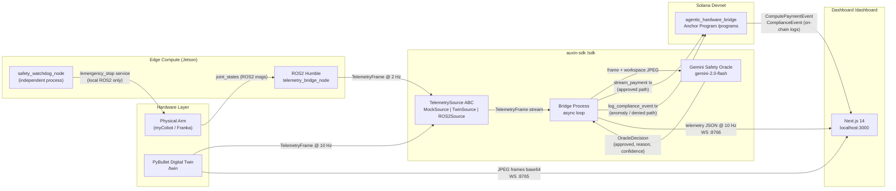

# Auxin Automata

**The Agentic Infrastructure API for Autonomous Hardware**

Auxin Automata is a middleware stack that gives physical hardware its own on-chain Solana wallet. The hardware autonomously signs micropayments for AI inference, and hashes kinematic safety telemetry to a tamper-proof on-chain compliance log — no human in the signing loop. The same SDK drives a mock generator, a PyBullet digital twin, and a live ROS2 robot arm, selected by a single environment variable with zero code changes. Built for the [Colosseum Frontier Hackathon](https://www.colosseum.org/) by Edwin Redhead and Tara Kasayapanand.

---

## Architecture



**Three pillars, one demo loop:**

1. **Hardware wallet** — the hardware keypair signs payment and compliance transactions autonomously; the owner account never touches the signing path after `initialize_agent`.
2. **M2M micropayments** — `stream_compute_payment` transfers lamports to a whitelisted provider after each oracle-approved action; sub-second finality, per-tx cap 0.001 SOL, rolling-window rate limit.
3. **Immutable compliance** — `log_compliance_event` writes a SHA-256 hash of the raw telemetry frame to a PDA; no rate limits, no budget checks, never dropped under backpressure.

---

## Quickstart

### `make demo` — Docker, ~60 s cold start

Requires Docker and a funded Devnet keypair. Everything else is containerised.

```bash
git clone https://github.com/EdwinIsCoding/auxin-automata
cd auxin-automata

# Copy and fill: at minimum HELIUS_RPC_URL and GEMINI_API_KEY
cp sdk/.env.example sdk/.env

make demo
# open http://localhost:3000
```

Services started: bridge (twin mode), Next.js dashboard, Prometheus, Grafana, twin WebSocket server.

### Manual run — no Docker

Prerequisites: Python 3.11, `uv`, Node 20, `pnpm`.

```bash
# Install all workspace deps
make bootstrap

# Configure the bridge
cp sdk/.env.example sdk/.env
# edit sdk/.env — set HELIUS_RPC_URL at minimum

# Terminal 1: start the digital twin
cd twin && python -m twin --mode ws        # streams JPEG frames on ws://localhost:8765

# Terminal 2: start the bridge (mock source — no hardware needed)
cd sdk
AUXIN_SOURCE=mock \
HELIUS_RPC_URL=https://api.devnet.solana.com \
uv run python scripts/run_bridge.py

# Terminal 3: start the dashboard
cd dashboard && pnpm dev
# open http://localhost:3000
```

To use the twin: set `AUXIN_SOURCE=twin`. To use the physical arm: `AUXIN_SOURCE=ros2`. Zero code changes required in either case.

---

## Deployed Addresses (Devnet)

| Resource | Address | Explorer |
|---|---|---|
| Program ID | `7sUSbF9zDN9QKVwA2ZGskg9gFgvbMuQpCdpt3hfgf1Mm` | [View](https://explorer.solana.com/address/7sUSbF9zDN9QKVwA2ZGskg9gFgvbMuQpCdpt3hfgf1Mm?cluster=devnet) |
| IDL Authority | `8bLUL5Ej8Q8bh4dJZzywj71kT5M8UsedTwDFFvrbzSDx` | [View](https://explorer.solana.com/address/8bLUL5Ej8Q8bh4dJZzywj71kT5M8UsedTwDFFvrbzSDx?cluster=devnet) |
| Deployed | 2026-04-14 | — |
| Agent PDA | `find_program_address([b"agent", owner_pubkey], program_id)` | derived |
| Provider PDA | `find_program_address([b"provider", provider_pubkey], program_id)` | derived |
| Compliance PDA | `find_program_address([b"log", agent_pda, slot_le_bytes], program_id)` | derived |

Sample agent and provider addresses are printed at bridge startup and by `scripts/smoke_test_devnet.ts` post-deploy.

---

## Environment Variables

### Bridge (`sdk/.env`)

| Variable | Required | Default | Description |
|---|---|---|---|
| `HELIUS_RPC_URL` | yes | — | Helius / QuickNode Devnet RPC endpoint |
| `AUXIN_SOURCE` | no | `mock` | Telemetry source: `mock` \| `twin` \| `ros2` |
| `SOLANA_RPC_URL` | no | `https://api.devnet.solana.com` | Fallback RPC |
| `HW_KEYPAIR_PATH` | no | `~/.config/auxin/hardware.json` | Hardware wallet keypair (JSON byte array) |
| `PROGRAM_ID` | no | from `programs/deployed.json` | Override on-chain program address |
| `PROVIDER_PUBKEY` | no | — | Base58 provider pubkey; payments skipped if unset |
| `GEMINI_API_KEY` | no | — | Gemini API key; oracle uses local fallback if absent |
| `BRIDGE_WS_PORT` | no | `8766` | Dashboard telemetry WebSocket port |
| `BRIDGE_HEALTHZ_PORT` | no | `8767` | `/healthz` JSON status port |
| `AUXIN_MOCK_RATE_HZ` | no | `10` | MockSource frame rate |
| `AUXIN_MOCK_ANOMALY_EVERY` | no | `12` | Anomaly injection cadence (frames) |
| `SENTRY_DSN` | no | — | Sentry error tracking |

### Dashboard (`dashboard/.env.local`)

| Variable | Required | Default | Description |
|---|---|---|---|
| `NEXT_PUBLIC_HELIUS_RPC_URL` | yes (live) | — | Helius RPC — must be `wss://` for event subscriptions |
| `NEXT_PUBLIC_PROGRAM_ID` | yes (live) | — | Deployed program address |
| `NEXT_PUBLIC_AGENT_PUBKEY` | no | — | Agent pubkey shown in Header |
| `NEXT_PUBLIC_BRIDGE_WS_URL` | no | `ws://localhost:8766` | Bridge telemetry WebSocket |
| `NEXT_PUBLIC_TWIN_WS_URL` | no | `ws://localhost:8765` | Twin JPEG frame WebSocket |
| `NEXT_PUBLIC_SENTRY_DSN` | no | — | Sentry error tracking |

### Edge (`edge/.env`)

| Variable | Required | Default | Description |
|---|---|---|---|
| `ROS_DOMAIN_ID` | no | `0` | ROS2 domain isolation |
| `JOINT_STATES_TOPIC` | no | `/joint_states` | Arm joint state topic |
| `TELEMETRY_RATE_HZ` | no | `2` | Throttled publish rate |
| `WATCHDOG_TORQUE_THRESHOLD` | no | `80.0` | E-stop torque threshold (N·m) |
| `WATCHDOG_CONSECUTIVE_FRAMES` | no | `3` | Consecutive over-threshold frames before e-stop |

### Twin (`twin/.env`)

| Variable | Required | Default | Description |
|---|---|---|---|
| `TWIN_MODE` | no | `ws` | `video` \| `ws` \| `both` |
| `TWIN_WS_PORT` | no | `8765` | JPEG frame WebSocket port |
| `TWIN_VIDEO_OUTPUT` | no | `./twin_demo.mp4` | MP4 output path |
| `TWIN_TELEMETRY_RATE_HZ` | no | `10` | Telemetry output rate |
| `PYBULLET_SIM_RATE_HZ` | no | `240` | Internal simulation rate |

---

## Port Map

| Port | Service |
|---|---|
| 3000 | Next.js dashboard |
| 3001 | Grafana |
| 8765 | Twin WebSocket (JPEG frames, base64) |
| 8766 | Bridge WebSocket (live telemetry JSON) |
| 8767 | Bridge `/healthz` (JSON status) |
| 9090 | Bridge Prometheus metrics |
| 9091 | Prometheus server (docker-compose demo) |

---

## Repo Layout

```
auxin-automata/
├── sdk/          Python auxin-sdk: wallet, schema, oracle, bridge service
├── programs/     Anchor/Rust: agentic_hardware_bridge Solana program
├── edge/         ROS2 Python nodes: telemetry bridge + safety watchdog (Jetson)
├── dashboard/    Next.js 14: twin viewport, payment ticker, compliance log
├── twin/         PyBullet digital twin: simulation, TwinSource, WS frame server
├── grafana/      Grafana dashboard JSON + provisioning configs
├── docs/         Architecture docs
├── scripts/      Deploy, healthcheck, smoke test
├── Makefile      bootstrap / lint / test / demo targets
└── CLAUDE.md     Engineering rules and agnosticism contracts
```

---

## Troubleshooting

**1. Bridge exits with `BlockhashNotFound` or `InsufficientFunds`**
The hardware wallet has no SOL. Use `AUXIN_SOURCE=mock` first to validate connectivity, then airdrop: `solana airdrop 2 <hardware_pubkey> --url https://api.devnet.solana.com`.

**2. Oracle always returns `used_fallback=True`**
`GEMINI_API_KEY` is unset or invalid. The bridge runs correctly — the local heuristic (torque threshold + fixture image label) handles decisions. Set the key to enable live Gemini calls.

**3. Dashboard shows no compliance or payment events**
Check: (a) `NEXT_PUBLIC_PROGRAM_ID` matches the deployed program on devnet. (b) `NEXT_PUBLIC_HELIUS_RPC_URL` is a WebSocket endpoint (`wss://`), not HTTP — `program.addEventListener` requires a persistent WS connection.

**4. `anchor test` fails with `Connection refused` on port 8899**
Anchor 1.0 requires `surfpool` for the integrated test runner. If `surfpool` is not installed, start the validator manually first: `solana-test-validator --reset --quiet &` then run `anchor test --skip-local-validator`.

**5. `AUXIN_SOURCE=twin` crashes with `ModuleNotFoundError: No module named 'twin'`**
The twin package must be visible to the bridge's virtual environment. From the repo root: `cd twin && uv pip install -e . --python ../sdk/.venv/bin/python`. Alternatively, run `make bootstrap` which wires the path dependency.

---

## Team

**Edwin Redhead** — [GitHub @EdwinIsCoding](https://github.com/EdwinIsCoding)
Primary: `/sdk`, `/programs`. Previously built Aegis, an AI-powered legal compliance tool, at HackEurope. Active in Superteam Ireland.

**Tara Kasayapanand** — [GitHub @tara-kas](https://github.com/tara-kas)
Primary: `/dashboard`, `/twin`. Joint ownership of `/edge` and root infrastructure.

Both are pursuing the Superteam Ireland hardware grant to fund Track B (Jetson + physical arm).

---

## License

Apache 2.0 — see [LICENSE](./LICENSE). Contributions welcome; see `CODEOWNERS` for reviewer routing.
