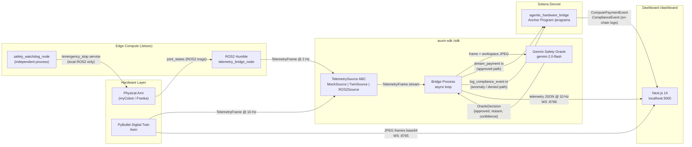

# Auxin Automata

**The Agentic Infrastructure API for Autonomous Hardware**

Auxin Automata gives physical hardware — robotic arms, drones, industrial machines — its own on-chain Solana wallet. The hardware autonomously streams micropayments for AI inference and compute, and hashes kinematic safety telemetry to Solana as a tamper-proof compliance log. The same SDK runs identically against a mock generator, a PyBullet digital twin, or a real ROS2 robot arm — selected by a single environment variable.

Built for the [Colosseum Frontier Hackathon](https://www.colosseum.org/) by Edwin Redhead and Tara Kasayapanand.

---

## Architecture



**Three pillars in one demo loop:**
1. **Hardware wallet** — hardware holds its own Solana keypair; it signs payment and compliance txs autonomously (owner never touches the signing path).
2. **M2M micropayments** — `stream_compute_payment` transfers lamports to a whitelisted provider after each oracle-approved action; <1s finality on Solana.
3. **Immutable compliance** — `log_compliance_event` writes a SHA-256 hash of the raw telemetry frame to a PDA; no rate limits, no budget checks, never dropped.

---

## Quickstart

### Option A — Docker (Phase 4, ~60 s cold start)

Requires only Docker and a funded Devnet keypair.

```bash
git clone https://github.com/EdwinIsCoding/auxin-automata
cd auxin-automata
cp sdk/.env.example sdk/.env          # fill in HELIUS_RPC_URL + GEMINI_API_KEY
make demo                              # docker-compose.demo.yml spins everything
# open http://localhost:3000
```

### Option B — Manual (works now)

Prerequisites: Python 3.11, `uv`, Node 20, `pnpm`.

```bash
# 1. Install dependencies
make bootstrap

# 2. Configure environment
cp sdk/.env.example sdk/.env
# edit sdk/.env — at minimum set HELIUS_RPC_URL

# 3. Start the digital twin
cd twin && python -m twin --mode ws    # streams on ws://localhost:8765

# 4. Start the bridge (mock mode — no hardware needed)
cd sdk
AUXIN_SOURCE=mock \
HELIUS_RPC_URL=https://api.devnet.solana.com \
python scripts/run_bridge.py

# 5. Start the dashboard
cd dashboard && pnpm install && pnpm dev
# open http://localhost:3000
```

Switch to twin mode by setting `AUXIN_SOURCE=twin`. Switch to the physical arm with `AUXIN_SOURCE=ros2`. Zero code changes required.

---

## Deployed Addresses (Devnet)

| Resource | Address | Explorer |
|---|---|---|
| Program ID | `7sUSbF9zDN9QKVwA2ZGskg9gFgvbMuQpCdpt3hfgf1Mm` | [View](https://explorer.solana.com/address/7sUSbF9zDN9QKVwA2ZGskg9gFgvbMuQpCdpt3hfgf1Mm?cluster=devnet) |
| IDL Authority | `8bLUL5Ej8Q8bh4dJZzywj71kT5M8UsedTwDFFvrbzSDx` | [View](https://explorer.solana.com/address/8bLUL5Ej8Q8bh4dJZzywj71kT5M8UsedTwDFFvrbzSDx?cluster=devnet) |
| Deployed | 2026-04-14 | — |
| Agent PDA | derived: `Pubkey::find_program_address([b"agent", owner_pubkey], program_id)` | — |
| Provider PDA | derived: `Pubkey::find_program_address([b"provider", provider_pubkey], program_id)` | — |

Sample agent and provider addresses are printed to stdout by `run_bridge.py` on startup and by `scripts/smoke_test_devnet.ts` after deploy.

---

## Environment Variables

### Bridge (`sdk/.env`)

| Variable | Required | Default | Description |
|---|---|---|---|
| `AUXIN_SOURCE` | no | `mock` | Telemetry source: `mock` \| `twin` \| `ros2` |
| `HELIUS_RPC_URL` | yes | — | Helius/QuickNode Devnet RPC endpoint |
| `SOLANA_RPC_URL` | no | `https://api.devnet.solana.com` | Fallback RPC if HELIUS not set |
| `AUXIN_PROGRAM_ID` | no | from `deployed.json` | Override on-chain program address |
| `HW_KEYPAIR_PATH` | no | `~/.config/auxin/hardware.json` | Hardware wallet keypair (JSON byte array) |
| `OWNER_KEYPAIR_PATH` | no | `~/.config/auxin/owner.json` | Owner wallet keypair |
| `PROVIDER_PUBKEY` | no | — | Base58 provider pubkey; payments skipped if unset |
| `GEMINI_API_KEY` | no | — | Gemini API key; oracle uses local fallback if absent |
| `HELIUS_API_KEY` | no | — | For `getPriorityFeeEstimate`; fixed 1000 µ-lamport fallback if absent |
| `BRIDGE_WS_PORT` | no | `8766` | Dashboard telemetry WebSocket port |
| `BRIDGE_HEALTHZ_PORT` | no | `8767` | `/healthz` JSON status port |
| `AUXIN_MOCK_RATE_HZ` | no | `10` | MockSource frame rate |
| `AUXIN_MOCK_ANOMALY_EVERY` | no | `12` | Anomaly injection cadence (frames) |

### Dashboard (`dashboard/.env.local`)

| Variable | Required | Default | Description |
|---|---|---|---|
| `NEXT_PUBLIC_HELIUS_RPC_URL` | yes | — | Helius RPC for on-chain event subscriptions |
| `NEXT_PUBLIC_PROGRAM_ID` | yes | — | Deployed program address |
| `NEXT_PUBLIC_BRIDGE_WS_URL` | no | `ws://localhost:8766` | Bridge telemetry WebSocket |
| `NEXT_PUBLIC_TWIN_WS_URL` | no | `ws://localhost:8765` | Twin JPEG frame WebSocket |
| `NEXT_PUBLIC_SENTRY_DSN` | no | — | Sentry error tracking (Phase 4) |

### Edge (`edge/.env`)

| Variable | Required | Default | Description |
|---|---|---|---|
| `ROS_DOMAIN_ID` | no | `0` | ROS2 domain isolation |
| `JOINT_STATES_TOPIC` | no | `/joint_states` | Arm joint state topic |
| `TELEMETRY_RATE_HZ` | no | `2` | Throttled publish rate |
| `WATCHDOG_TORQUE_THRESHOLD` | no | `80.0` | E-stop torque threshold (N·m) |

### Twin (`twin/.env`)

| Variable | Required | Default | Description |
|---|---|---|---|
| `TWIN_MODE` | no | `ws` | `video` \| `ws` \| `both` |
| `TWIN_WS_PORT` | no | `8765` | JPEG frame WebSocket port |
| `TWIN_VIDEO_OUTPUT` | no | `./twin_demo.mp4` | MP4 output path (video mode) |

---

## Port Map

| Port | Service |
|---|---|
| 3000 | Next.js dashboard |
| 8765 | Twin WebSocket (JPEG frames, base64) |
| 8766 | Bridge WebSocket (live telemetry JSON) |
| 8767 | Bridge `/healthz` (JSON status) |
| 9090 | Prometheus metrics (Phase 4) |

---

## Repo Layout

```
auxin-automata/
├── sdk/          Python auxin-sdk: wallet, schema, oracle, bridge service
├── programs/     Anchor/Rust: agentic_hardware_bridge Solana program
├── edge/         ROS2 Python nodes: telemetry bridge + safety watchdog (Jetson)
├── dashboard/    Next.js 14: twin viewport, payment ticker, compliance log
├── twin/         PyBullet digital twin: simulation, TwinSource, WS frame server
├── docs/         Architecture docs and design documents
├── scripts/      Deploy, healthcheck, and keypair bootstrap scripts
├── Makefile      bootstrap / lint / test / demo targets
└── CLAUDE.md     Engineering rules and agnosticism contracts
```

---

## Troubleshooting

**1. `bridge.py` exits immediately with `BlockhashNotFound`**
The Devnet RPC is congested or the keypair has no SOL. Run `AUXIN_SOURCE=mock python scripts/run_bridge.py` first, then airdrop with `HardwareWallet.request_airdrop(rpc_url, 1.0)`.

**2. Oracle always returns `used_fallback=True`**
`GEMINI_API_KEY` is not set or is invalid. The bridge still runs correctly — the local heuristic (torque threshold + image label check) is used. Set the key to enable the live Gemini call.

**3. Dashboard shows no compliance events**
Check: (a) `NEXT_PUBLIC_PROGRAM_ID` matches the deployed program, (b) `NEXT_PUBLIC_HELIUS_RPC_URL` is a WebSocket endpoint (`wss://`), not HTTP. On-chain events are subscribed via `program.addEventListener` which requires a WS connection.

**4. `anchor test` fails with `Error: Account not found`**
Run `solana-test-validator` locally first, or pass `--provider.cluster devnet` with a funded keypair. Ensure `HELIUS_RPC_URL` is set for devnet runs.

**5. `AUXIN_SOURCE=twin` crashes with `ModuleNotFoundError: No module named 'twin'`**
The twin package must be installed into the bridge's Python environment: `cd twin && uv pip install -e . --target ../sdk/.venv/lib/python3.11/site-packages` or add twin as a path dependency in `sdk/pyproject.toml`.

---

## Team

**Edwin Redhead** — [GitHub @EdwinIsCoding](https://github.com/EdwinIsCoding)
Primary: `/sdk`, `/programs`. Previously built Aegis (AI-powered legal compliance tool) at HackEurope; active in Superteam Ireland.

**Tara Kasayapanand** — [GitHub @tara-kas](https://github.com/tara-kas)
Primary: `/dashboard`, `/twin`. Joint ownership of `/edge` and root files.

Both team members are active in the Superteam Ireland community and are pursuing follow-on funding through Superteam grants for the physical arm (Track B).

---

## License

Apache 2.0 — see [LICENSE](./LICENSE).

Contributions welcome. Open an issue or PR; see `CODEOWNERS` for reviewer routing.
